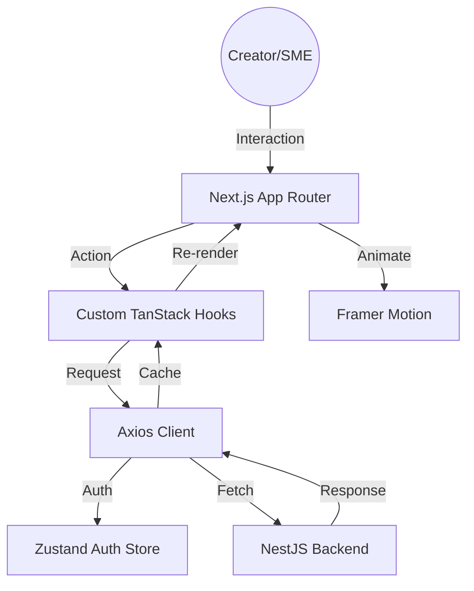

# <p align="center">🎨 CIAP Frontend: Modern Studio Edition</p>

<p align="center">
  
  
  
  
</p>

<p align="center">
  
  
  
</p>

---

## 🌟 Vision
**CIAP (Creator Influence & Analytics Platform)** is a high-fidelity discovery engine designed to bridge the gap between raw social data and actionable market intelligence. Built with a "Modern Studio" aesthetic, it prioritizes tactile interaction, data density, and cinematic transitions.

> [!TIP]
> This frontend is optimized for **high-performance data visualization**. It uses TanStack Query v5 for intelligent caching and Framer Motion for fluid layout transitions.

---

## 🛠 The Power Stack

### Core Engine
- **Framework**: [Next.js 16](https://nextjs.org/) (App Router Architecture)
- **Runtime**: [React 19](https://react.dev/) (Concurrent Rendering)
- **Styling**: [Tailwind CSS 4.0](https://tailwindcss.com/) (Next-gen CSS engine)
- **State**: [Zustand](https://github.com/pmndrs/zustand) (Atomic session management)

### Intelligence Layer
- **Data Fetching**: [TanStack Query v5](https://tanstack.com/query/latest)
- **Visualization**: [Recharts](https://recharts.org/) (Responsive charting)
- **Iconography**: [Phosphor Icons](https://phosphoricons.com/) (Duo-tone professional set)

### Animation & FX
- **Transitions**: [Framer Motion 12](https://www.framer.com/motion/)
- **Toasts**: [Sonner](https://sonner.stevenly.kim/) (Stacked notifications)

---

## 📐 Architecture & Data Flow



---

## 🎨 Design System: "Modern Studio"

Our design language is inspired by physical magazines and recording studio consoles.

| Token | Value | Purpose |
| :--- | :--- | :--- |
| **Primary Font** | `Bricolage Grotesque` | Editorial Headings |
| **Secondary Font** | `Outfit` | High-readability Body |
| **Border Style** | `2px solid #000000` | Tactile "Neo-Brutalism" |
| **Shadows** | `4px 4px 0px #000000` | Physical "Pop" effect |
| **Accents** | Blue, Pink, Green, Purple | Contextual data sectors |

---

## 🚀 Feature deep-dive

### 1. 🔐 High-Security Auth
- **Google OAuth 2.0**: Direct onboarding for YouTube creators.
- **Session Persistence**: Secure, cross-tab session synchronization with auto-refreshing tokens.
- **Hydration Guards**: Preventing layout shifts during authentication checks.

### 2. 📈 Creator Studio Hub
- **Metric Cards**: Hover-reactive cards with real-time YouTube data.
- **Performance Grids**: Visualizing view velocity and subscriber growth.
- **Influence Score**: A proprietary data-dial showing market impact.

### 3. 🔍 Market Discovery
- **Advanced Filters**: Search creators by niche, engagement rate, or audience size.
- **Talent Cards**: Neo-brutalist cards designed for rapid scanning by SME/Brands.
- **Verified Badge System**: Ensuring data integrity across the platform.

---

## 📂 Project Structure

```bash
frontend/
├── app/                  # Route Groups: (auth), (protected), layout
│   ├── (auth)/           # Login, Signup, Callback flows
│   ├── (protected)/      # Dashboard, Discovery, Settings
│   └── globals.css       # Tailwind 4 configuration
├── components/           # Component Library
│   ├── layout/           # Sidebar, Header, MobileNav, AuthGuard
│   ├── ui/               # Buttons, Skeleton, Popover, MetricCards
│   └── shared/           # Reusable data visualization units
├── lib/                  # Application Logic
│   ├── api/              # Axios interceptors & TanStack Query hooks
│   ├── auth/             # Zustand session management
│   └── utils/            # cn() utility and formatting helpers
├── public/               # Brand assets & SVG illustrations
└── next.config.ts        # Performance & Proxy optimization
```

---

## ⚙️ Development Setup

### Prerequisites
- **Node.js**: v24+
- **PNPM**: v10+

### Installation
```bash
# Install dependencies
pnpm install

# Setup environment
cp .env.example .env.local

# Boot the studio
pnpm dev
```

### Environment Variables
| Variable | Default | Description |
| :--- | :--- | :--- |
| `NEXT_PUBLIC_API_URL` | `http://localhost:3000` | Backend API Endpoint |
| `NEXT_PUBLIC_APP_URL` | `http://localhost:4000` | Local Frontend URL |

---

## 🏁 Quality Assurance
- **Linting**: `pnpm run lint` (ESLint 9 + Next Config)
- **Type Safety**: `pnpm run typecheck` (Strict mode enabled)
- **Production**: `pnpm run build` (Static Analysis & Hydration Optimization)

---

<p align="center">
  Proudly built by <b>Team B</b> 🚀<br>
  <i>"Empowering the next generation of influence."</i>
</p>
